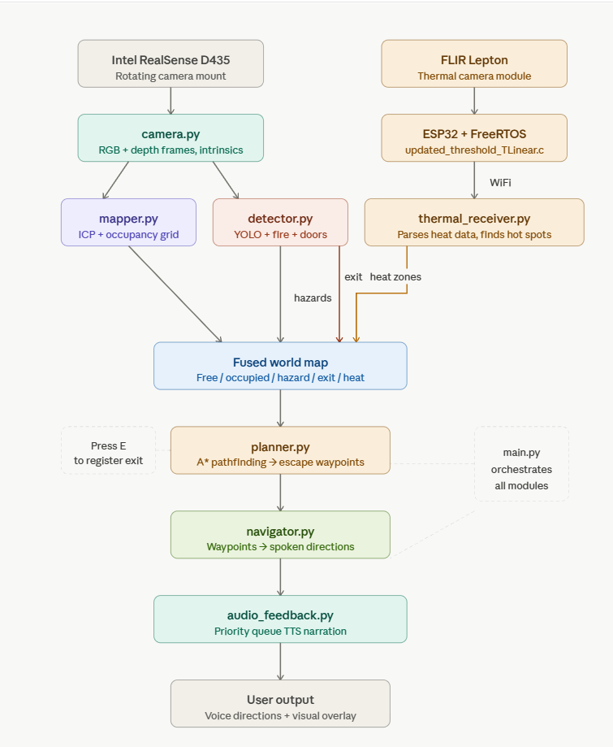

## Real Time Vision-Based Hazard Detection and Navigation Assistance System
---
Department of Electrical and Computer Engineering, Stony Brook University  
Team: Depth Perception  
Advisor: Prof. Murali Subbarao  
GitHub Author: Naafiul Hossain  
Last Updated: April 18, 2026  


---
# In Door Hazard Detection & Escape Route System

A real-time in door safety system using an Intel RealSense D435 depth camera. The system detects hazards, builds a live map of the kitchen, finds a safe escape route to the exit, and guides the user out using spoken audio directions.

---

## How It Works — Big Picture

The system uses both RGB/depth and thermal sensing to monitor the environment in real time.

The RealSense camera rotates continuously around the kitchen. Every frame it captures, the system does four things at once:

1. **Figures out where the camera is pointing** (ICP)  
2. **Identifies hazards, people, and doors** in the image (YOLO)  
3. **Updates a top-down map** of the kitchen with all of that information  
4. **Plans the safest path to the exit** and speaks the directions aloud (A*)  

In parallel, a FLIR Lepton thermal camera (via an ESP32 running FreeRTOS) streams temperature data over Wi-Fi. This data is processed to detect high-temperature regions (e.g., fire, hot surfaces) and is fused into the world map as additional hazard zones.


---

## Key Terminology

### ICP — Iterative Closest Point
ICP is the algorithm in `mapper.py` that tracks the rotating camera without any angle sensor. Every frame, it takes the current depth point cloud and compares it to the previous one. By finding the rotation and translation that best aligns the two clouds, it figures out how much the camera has moved. Over many frames this builds up a full picture of where the camera has been — and therefore what the whole kitchen looks like.

**In plain terms:** ICP is how the system answers "where is the camera pointing right now?"

**Limitation:** ICP can drift over time, especially in dynamic scenes (steam, moving people). Adding a rotary encoder to the camera mount would make this much more reliable.

### YOLO — You Only Look Once
YOLO is the neural network in `detector.py` that identifies objects in the camera's RGB image. Unlike older detection methods that scan the image many times, YOLO divides the frame into a grid and predicts all bounding boxes and class labels in a single pass — making it fast enough to run in real time at 30fps.

The system uses **YOLOv8** (the `yolov8n.pt` model), pre-trained on the COCO dataset which includes 80 object categories. It detects:
- People
- Knives, scissors, bottles, cups, laptops, phones, and other hazard objects
- Open doorways (via a depth-gap geometric method, since "door" is not a COCO class)
- Fire and flames (via an HSV colour heuristic, since fire is not a COCO class)

**In plain terms:** YOLO is how the system answers "what objects are in this frame and where are they?"

**Limitation:** The model was trained on general images, not kitchen-specific hazards. Things like a pot boiling over, a hot surface, or a spill on the floor require custom training data to detect reliably.

### A* (A-Star) Pathfinding
A* is the algorithm in `planner.py` that finds the shortest safe path from the user's position to the exit on the occupancy grid. It works by scoring every candidate cell with two numbers added together: how far it is from the start, and an estimate of how far it still is from the goal. It always expands the cell with the lowest combined score, which guarantees the shortest path is found without wasting time exploring dead ends.

Hazard zones and occupied cells are marked as impassable, so A* naturally routes around fires, walls, and obstacles.

**In plain terms:** A* is how the system answers "what is the safest way to get from here to the exit?"

### Occupancy Grid
A top-down 2D map of the kitchen stored as a 400×400 grid of cells (each cell = 5cm × 5cm, covering a 20m × 20m area). Each cell has one of five states:

| Value | Meaning |
|-------|---------|
| 0 — Unknown | Not yet seen by the camera |
| 1 — Free | Safe to walk through |
| 2 — Occupied | Wall, furniture, or obstacle |
| 3 — Hazard | Fire, knife, or other danger (inflated with a safety buffer) |
| 4 — Exit | Registered door location |

### Point Cloud
A collection of 3D points generated from the depth camera. Each pixel in the depth image becomes a point in 3D space with X, Y, Z coordinates in metres relative to the camera. Point clouds are the raw material that ICP uses to track camera movement and that the occupancy grid is built from.

### Depth Deprojection
The process of converting a 2D pixel location plus a depth measurement into a real-world 3D coordinate. The RealSense camera's intrinsic parameters (focal length, optical centre) are used to calculate exactly where in 3D space a detected object is. This is how every YOLO detection gets a real-world position.

---

## File Reference

### `main.py` — Orchestrator
The main loop that ties every module together. Runs continuously, once per camera frame. Responsibilities:
- Calls `camera.py` to get each frame
- Calls `mapper.py` to update the world map
- Calls `detector.py` to run YOLO detection
- Registers hazards and exit locations on the map
- Detects small floor-level obstacles via depth mask (catches things YOLO misses)
- Calls `planner.py` to replan the escape route every 3 seconds
- Calls `navigator.py` to convert the path to spoken instructions
- Calls `audio_feedback.py` to speak warnings and directions
- Renders the three-panel display: RGB feed, depth heatmap, top-down grid map

**Controls:**
- `Q` or `ESC` — quit
- `E` — manually register the exit (point the camera at the door and press E)

---

### `camera.py` — RealSense Interface
Wraps the Intel RealSense D435 pipeline. Handles stream configuration, frame alignment, and depth-to-3D projection.

Key methods:
- `start()` — initialises the camera and caches intrinsic parameters
- `get_frames()` — returns aligned colour image, depth image, and depth frame
- `deproject_pixel(px, py, depth_m)` — converts a 2D pixel + depth into a 3D `[X, Y, Z]` point in camera space
- `stop()` — cleanly shuts down the pipeline

---

### `mapper.py` — Occupancy Grid Builder
Builds and maintains the 2D top-down map of the kitchen. The most complex module in the system.

Key responsibilities:
- Converts each depth frame into a point cloud
- Uses **ICP** to estimate camera rotation between frames (no angle encoder required)
- Accumulates camera pose over time to know where the camera is in the world
- Projects floor-level points from the point cloud into the occupancy grid
- Inflates hazard zones with a 0.6m safety buffer around each detected hazard
- Tracks the exit cell location once registered

Key constants (tunable in the file):
- `GRID_RES = 0.05` — cell size in metres (5cm)
- `HAZARD_INFLATE_M = 0.6` — safety bubble radius around hazards
- `ICP_DISTANCE_THRESH = 0.1` — how closely ICP tries to match point clouds

---

### `detector.py` — Object Detection
Runs all visual detection on the RGB frame. Uses YOLOv8 for object detection, a colour heuristic for fire, and a depth-gap geometric method for doors.

Key responsibilities:
- Loads and runs the YOLOv8 model on every frame
- Returns `DetectionResult` objects containing lists of hazards, persons, and doors
- Each detection includes: label, confidence, bounding box, depth in metres, 3D world coordinates, and direction (LEFT / CENTER / RIGHT)
- Detects fire via HSV colour range in the image (no YOLO class needed)
- Detects open doorways by finding wide vertical bands of far/zero depth in the middle of the frame

Tunable constants:
- `YOLO_CONF = 0.25` — minimum confidence to report a detection (lower = more detections, more false positives)
- `FIRE_MIN_AREA = 500` — minimum pixel area to report a fire detection
- `DOOR_MIN_WIDTH_PX = 60` — minimum pixel width of a depth gap to count as a door

---

### `planner.py` — A* Path Planner
Finds the shortest safe path from the user's current cell to the exit on the occupancy grid.

Key responsibilities:
- Implements 8-directional A* (can move diagonally as well as cardinally)
- Treats FREE and UNKNOWN cells as traversable; OCCUPIED and HAZARD cells are blocked
- Uses octile distance as the heuristic (optimal for 8-directional grids)
- `simplify_path()` reduces the raw waypoint list to key turning points

Key functions:
- `astar(grid, start, goal)` — returns list of `(row, col)` waypoints or `[]` if no path exists
- `simplify_path(path, tolerance=3)` — keeps every Nth waypoint to reduce verbosity

---

### `navigator.py` — Direction Generator
Converts a list of grid waypoints into natural language directions suitable for audio playback.

Key responsibilities:
- Calculates the compass bearing between each consecutive pair of waypoints
- Groups consecutive steps in the same direction into segments
- Detects turn changes between segments and describes them (turn left, turn right, turn around)
- Prepends hazard warnings and appends an "exit reached" callout
- `format_for_display()` formats instructions as a numbered list for the on-screen overlay

Example output:
```
Warning: fire detected. Follow the escape route.
Move forward 1.5 metres.
Turn left. Move forward 0.5 metres.
Move forward-right 1.0 metres.
You have reached the exit. Get out now.
```

---

### `audio_feedback.py` — Text-to-Speech
Thread-safe audio output using `pyttsx3`. Runs the TTS engine in a dedicated background thread to avoid the Windows COM conflict (`WinError -2147417850`).

Key responsibilities:
- `speak(text, force)` — speak text with cooldown rate limiting
- `speak_hazard(dist_m, direction, hazard_now)` — rate-limited obstacle warning with stable detection debounce; resets after each announcement so it can trigger repeatedly
- `speak_route(instructions)` — speak a full escape route instruction list sequentially in the background, cancelling any previous narration
- `cancel_route()` — stop the current route narration immediately

Key constants:
- `cooldown_sec = 2.5` — minimum seconds between repeated announcements
- `stable_sec = 0.5` — how long a hazard must be visible before it's announced

---

### `thermal_receiver.py` — Thermal Stream Receiver
Background TCP module that receives and processes thermal data streamed from the ESP32-based FLIR Lepton system.

Key responsibilities:
- Listens for incoming thermal frames over Wi-Fi/TCP from the ESP32
- Parses the custom packet format (header + raw frame payload)
- Converts TLinear thermal counts into real-world temperature values (°C / °F)
- Tracks maximum temperature and detects “hot” regions using configurable thresholds
- Stores the latest thermal frame and state in a thread-safe structure for system-wide access
- Exposes APIs (`get_latest_state`, `get_latest_frame`) for integration with the main pipeline

Key features:
- Supports real-time streaming at frame-level granularity
- Automatically handles connection loss and reconnection
- Decodes ESP32 mode flags (high gain, TLinear, resolution modes)
- Designed for future sensor fusion with RGB + depth data

---

### `updated_threshold_TLinear_highgain.c` — ESP32 Thermal Streamer
Embedded firmware running on the ESP32 (FreeRTOS-based) that interfaces with the FLIR Lepton thermal camera and streams data to the host system.

Key responsibilities:
- Configures the FLIR Lepton using I2C (CCI) and captures frames over SPI (VoSPI)
- Enables radiometric TLinear mode with high gain for accurate temperature measurement
- Captures full thermal frames (80×60) in real time
- Computes frame statistics (max value, averages, hot threshold detection)
- Packages data into a structured header + payload format
- Streams thermal data over Wi-Fi using a TCP client to the Python receiver

Key features:
- Runs on FreeRTOS for real-time task scheduling and concurrency
- Uses dual interfaces:
  - I2C → camera configuration
  - SPI → high-speed frame acquisition
- Supports temperature-based thresholding (e.g., detecting surfaces above ~60°C)
- Implements automatic reconnection and continuous streaming
- Designed for integration with higher-level perception and sensor fusion systems

---
## Project Structure

```
src/
├── main.py # Main loop — orchestrates full system
├── camera.py # RealSense D435 capture and depth projection
├── mapper.py # ICP pose tracking + occupancy grid
├── detector.py # YOLOv8 + fire/smoke + door detection
├── planner.py # A* pathfinding on occupancy grid
├── navigator.py # Waypoints → spoken directions
├── audio_feedback.py # Thread-safe TTS with Windows COM fix
├── thermal_receiver.py # TCP receiver for ESP32 thermal stream
└── hazard_stub.py # Legacy stub — no longer used

embedded/
└── updated_threshold_TLinear_highgain.c # ESP32 (FreeRTOS) firmware for FLIR Lepton thermal streaming
```

---

## Installation

```bash
pip install pyrealsense2 opencv-python numpy open3d ultralytics pyttsx3 pythoncom
```

On Linux, also install the TTS engine:
```bash
sudo apt-get install espeak
```

---

## Running the System

```bash
cd src
python main.py
```

On first run, YOLOv8 will automatically download the `yolov8n.pt` model (~6MB). An internet connection is required for this step only.

---

## Display

The window shows three panels side by side:

| Panel | What It Shows |
|-------|--------------|
| Left — RGB feed | Live camera image with detection boxes (red = hazard, blue = person, green = exit) |
| Centre — Depth heatmap | Colour-coded depth map (blue = close, red = far) |
| Right — Grid map | Top-down occupancy map (green = free, dark = obstacle, red = hazard, yellow = exit, orange = planned escape path, white dot = user) |

---
## Results

### System Demonstrations

<p align="center">
  
</p>
<p align="center"><em>Figure 1: ESP32 and FLIR Lepton thermal camera hardware setup used for real-time temperature streaming.</em></p>

---

<p align="center">
  
</p>
<p align="center"><em>Figure 2: Thermal reading of a stove reaching approximately 359°F, demonstrating high-temperature detection capability.</em></p>

---

<p align="center">
  
</p>
<p align="center"><em>Figure 3: Detection of a small kitchen stove fire with 41% confidence using the fire detection pipeline.</em></p>

---

<p align="center">
  
</p>
<p align="center"><em>Figure 4: Exit successfully detected with navigation instructions displayed at the bottom of the interface.</em></p>

---

<p align="center">
  
</p>
<p align="center"><em>Figure 5: Person detection using YOLOv8, with bounding box and spatial awareness integrated into the system.</em></p>
