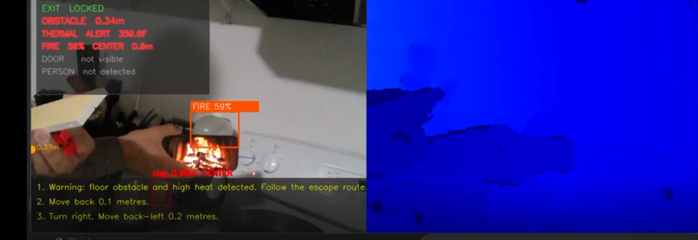

# Vision-Based Smart Indoor Hazard Detection & Navigation System

Department of Electrical and Computer Engineering, Stony Brook University  
Team: Depth Perception  
Advisor: Prof. Murali Subbarao  
Author: Naafiul Hossain  

---

## Overview

A real-time multimodal safety system that combines computer vision, depth sensing, and thermal imaging to detect indoor hazards and guide users to a safe exit. The system integrates YOLOv8 object detection, ICP-based mapping, A* path planning, and an embedded ESP32 + FLIR thermal pipeline to enable robust perception in real-world environments.

---

## 🚀 Demo — Full System in Action

<p align="center">
  <a href="https://drive.google.com/file/d/1avbhyp39WIdrwuDVQR6I6T60N_gQK89k/view?usp=sharing">
    
  </a>
</p>

<p align="center"><em>Click to watch the full system demo</em></p>

---

## Tech Stack

- **Computer Vision:** YOLOv8 (Ultralytics), OpenCV  
- **Depth Sensing:** Intel RealSense D435i  
- **Thermal Sensing:** FLIR Lepton + ESP32 (FreeRTOS, VoSPI, I2C)  
- **Mapping & Localization:** ICP (Open3D), Occupancy Grid Mapping  
- **Path Planning:** A* Algorithm  
- **Embedded Systems:** ESP32 (C, FreeRTOS)  
- **Languages:** Python, C  

---

## How It Works — Big Picture

The system uses both RGB/depth and thermal sensing to monitor the environment in real time.

Each frame, the system performs four key operations:

1. **Camera Localization** — Estimates camera pose using ICP  
2. **Object Detection** — Identifies hazards, people, and doors using YOLOv8  
3. **Mapping** — Updates a top-down occupancy grid of the environment  
4. **Navigation** — Computes the safest path to an exit using A* and provides spoken directions  

In parallel, a FLIR Lepton thermal camera streams temperature data via an ESP32 running FreeRTOS. Thermal data is processed and fused into the occupancy grid as additional hazard zones.

<p align="center">
  
</p>
<p align="center"><em>Figure: System Architecture Overview</em></p>

---

## Thermal Sensing System — FLIR Lepton + ESP32

To complement RGB and depth-based perception, the system integrates a thermal sensing pipeline using a FLIR Lepton radiometric thermal camera. Unlike standard cameras, the FLIR Lepton measures infrared radiation to capture temperature data, enabling detection of heat sources not visible in RGB images.

### Hardware Integration

The FLIR Lepton is interfaced with an ESP32 microcontroller running **FreeRTOS**, enabling concurrent handling of acquisition and transmission.

- **I2C (CCI):** Sensor configuration and control  
- **VoSPI:** High-speed thermal frame transfer (80×60 resolution)  

### Data Pipeline

- Frames captured via VoSPI  
- Converted to temperature (°C / °F) using TLinear  
- Hot regions detected via thresholds  
- Data streamed over Wi-Fi (TCP)  
- Parsed by `thermal_receiver.py` and fused into the occupancy grid  

---

### Thermal Imaging Results

<p align="center">
  
</p>
<p align="center"><em>Figure T1: ESP32 and FLIR Lepton wiring and hardware setup.</em></p>

---

<p align="center">
  
</p>
<p align="center"><em>Figure T2: Thermal map of an active stove showing high-temperature regions.</em></p>

---

<p align="center">
  
</p>
<p align="center"><em>Figure T3: Thermal image capturing a human heat signature.</em></p>

---

These results demonstrate that the thermal subsystem provides reliable temperature-based perception, enhancing hazard detection beyond RGB and depth sensing.

---

## Key Terminology

### ICP — Iterative Closest Point
Tracks camera motion by aligning consecutive depth point clouds.

### YOLO — You Only Look Once
Real-time object detection model used to identify hazards and objects.

### A* Pathfinding
Finds the shortest safe route through the occupancy grid.

### Occupancy Grid
2D map representing free space, obstacles, hazards, and exits.

### Point Cloud
3D representation of the environment from depth data.

### Depth Deprojection
Converts 2D pixels + depth into real-world 3D coordinates.

---

## File Reference

### `main.py` — System Orchestrator
Coordinates perception, mapping, planning, and audio feedback.

### `camera.py` — RealSense Interface
Handles RGB/depth capture and 3D projection.

### `mapper.py` — Mapping Engine
Performs ICP-based localization and builds occupancy grid.

### `detector.py` — Object Detection
Runs YOLOv8 and detects hazards, fire, and doors.

### `planner.py` — Path Planner
Implements A* pathfinding on occupancy grid.

### `navigator.py` — Direction Generator
Converts paths into spoken instructions.

### `audio_feedback.py` — Text-to-Speech
Handles real-time voice output using threaded TTS.

### `thermal_receiver.py` — Thermal Data Receiver
Processes thermal data from ESP32 over TCP.

### `updated_threshold_TLinear_highgain.c` — ESP32 Firmware
Captures and streams thermal data using FreeRTOS.

---

## Results

The following results demonstrate the system’s ability to detect hazards and guide navigation in real time.

<p align="center">
  
</p>
<p align="center"><em>Figure 1a: Intel RealSense D435i setup.</em></p>

<p align="center">
  
</p>
<p align="center"><em>Figure 1b: ESP32 + FLIR thermal setup.</em></p>

---

<p align="center">
  
</p>
<p align="center"><em>Figure 2: Stove thermal reading (~359°F).</em></p>

---

<p align="center">
  
</p>
<p align="center"><em>Figure 3: Fire detection at 41% confidence.</em></p>

---

<p align="center">
  
</p>
<p align="center"><em>Figure 4: Exit detection with navigation instructions.</em></p>

---

<p align="center">
  
</p>
<p align="center"><em>Figure 5: Detection of household objects using YOLOv8.</em></p>

---

<p align="center">
  
</p>
<p align="center"><em>Figure 6: Person detection with spatial awareness.</em></p>

---

## Installation

```bash
pip install pyrealsense2 opencv-python numpy open3d ultralytics pyttsx3 pythoncom

---
## Project Structure

```
src/
├── main.py # Main loop — orchestrates full system
├── camera.py # RealSense D435 capture and depth projection
├── mapper.py # ICP pose tracking + occupancy grid
├── detector.py # YOLOv8 + fire/smoke + door detection
├── planner.py # A* pathfinding on occupancy grid
├── navigator.py # Waypoints → spoken directions
├── audio_feedback.py # Thread-safe TTS with Windows COM fix
├── thermal_receiver.py # TCP receiver for ESP32 thermal stream
└── hazard_stub.py # Legacy stub — no longer used

embedded/
└── updated_threshold_TLinear_highgain.c # ESP32 (FreeRTOS) firmware for FLIR Lepton thermal streaming
```

---

## Installation

```bash
pip install pyrealsense2 opencv-python numpy open3d ultralytics pyttsx3 pythoncom
```

On Linux, also install the TTS engine:
```bash
sudo apt-get install espeak
```

---

## Running the System

```bash
cd src
python main.py
```

On first run, YOLOv8 will automatically download the `yolov8n.pt` model (~6MB). An internet connection is required for this step only.

---

## Display

The window shows three panels side by side:

| Panel | What It Shows |
|-------|--------------|
| Left — RGB feed | Live camera image with detection boxes (red = hazard, blue = person, green = exit) |
| Centre — Depth heatmap | Colour-coded depth map (blue = close, red = far) |
| Right — Grid map | Top-down occupancy map (green = free, dark = obstacle, red = hazard, yellow = exit, orange = planned escape path, white dot = user) |


